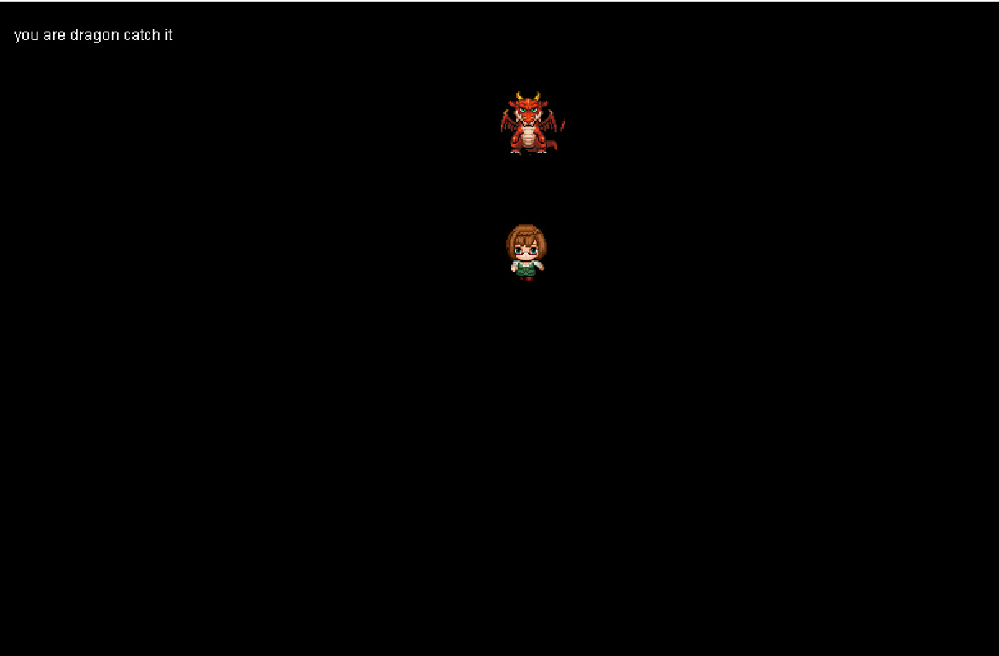
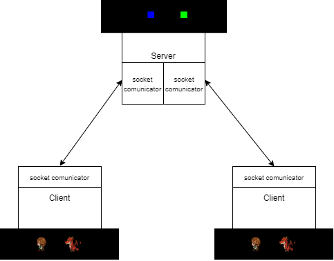
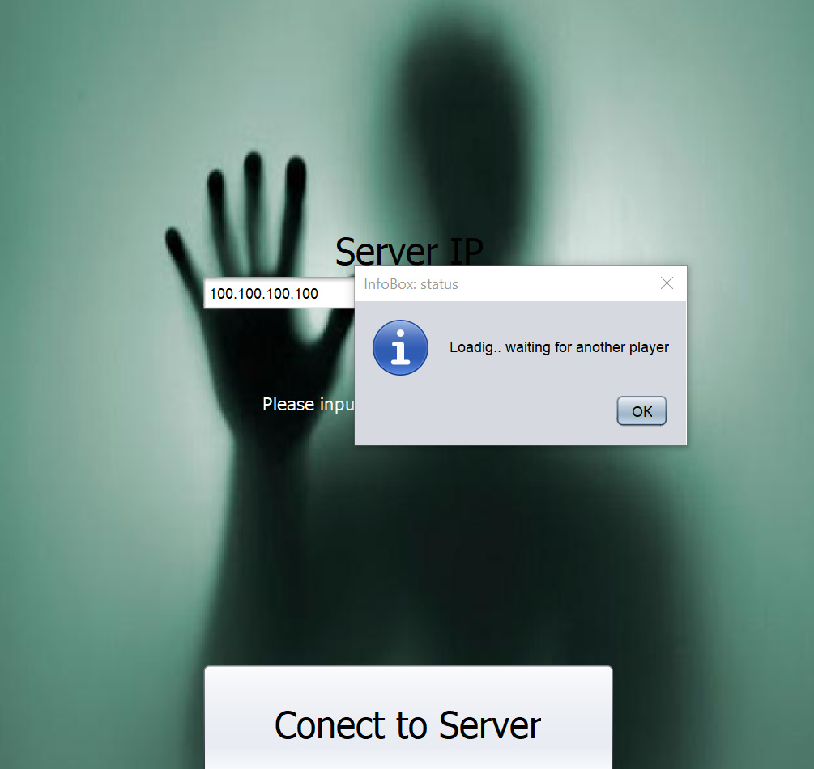

# Java Chasing Game(PvP) (Beta)

**Java Chasing Game** (Java Chasing Game) is an chasing game
that can play with 2 players. I created a two-player chasing game, with 2 clients(player) and a server as a part of a introduction of operating system at University. One of the main goals of this project is revealing working process about critival detection and socket theory. There have 2 projects in this repository(Clinet and Server).
In the client side, there have 2 players. One for chasing side(dragon) and escape side(girl). You can see your side at left of uppper conner.
 

 
I developed this game by eclipse 2019(https://www.eclipse.org/) that is one of IDE(Integrated Development Environment). The source code is in this repository.

**Technology**
This game is using core Java , Java Swing GUI libraries , javax libraries and socket. It uses custom drawing for game components and self-programmed logic for chasing game. 

**How to use**
--Client
 
1) It have .jar file in this repository is in the Client folder.  You can run the executable .jar file, named client.jar to play. you have to run program for 2 client machine.
2) When open gui display, it have start button that you can click it. 
3) After click start button, you would have to set IP address of server in the text box and click connect button.
   You have to wait for another player for a while time. 

4) Finaly, You can plaw with arrow button in keyboard

 
--Server
 
1) It have .jar file in this repository is in the Myserver folder.  You can run the executable .jar file, named server.jar to open server and wait for 2 clients to connect it. You can run it from eclipse project too.